# 🌍 Ikshanam - Smart Cultural Storyteller

<div align="center">


**AI-Powered Tales from Around the World**

[](https://streamlit.io)
[](https://python.org)
[](https://groq.com)

*Generate beautiful, culturally-rich stories with AI narration and video*

</div>

---

## ✨ Features

- 🌏 **8+ Cultural Traditions** — Indian, Japanese, African, Celtic, Chinese, Greek, Arabian, Native American & custom cultures
- 📖 **Multiple Story Types** — Folk Tales, Mythology, Historical Stories, Moral Stories, Legends & more
- 🎭 **Customizable Tones** — Simple, Dramatic, Child-friendly, Mysterious, Humorous
- 🗣️ **Multi-Language Support** — Generate stories in 15+ languages including Hindi, Bengali, Tamil, Spanish, French, Japanese, and more
- 🎙️ **Neural Voice Narration** — High-quality AI voices using Microsoft Edge TTS
- 🎬 **Video Generation** — Automatically create narrated story videos with cultural themes
- 📱 **Beautiful UI** — Immersive dark theme with cultural aesthetics

---

## 🚀 Quick Start

### Prerequisites

- Python 3.8 or higher
- [Groq API Key](https://console.groq.com/keys) (free)

### Installation

1. **Clone the repository**
   ```bash
   git clone https://github.com/d-anushtup/ikshanam.git
   cd ikshanam
   ```

2. **Create a virtual environment**
   ```bash
   python -m venv venv
   source venv/bin/activate  # On Windows: venv\Scripts\activate
   ```

3. **Install dependencies**
   ```bash
   pip install -r requirements.txt
   ```

4. **Set up your API key**
   ```bash
   # Create a .env file
   echo "GROQ_API_KEY=your-api-key-here" > .env
   ```
   
   Get your free API key at [console.groq.com/keys](https://console.groq.com/keys)

5. **Run the app**
   ```bash
   streamlit run streamlit_app.py
   ```

6. **Open in browser**
   
   Visit `http://localhost:8501` 🎉

---

## 🎨 Supported Cultures

| Culture | Theme | Story Elements |
|---------|-------|----------------|
| 🇮🇳 Indian | Dharma, Karma, Wisdom | Village life, festivals, nature metaphors |
| 🇯🇵 Japanese | Honor, Zen, Nature | Kami spirits, cherry blossoms, contemplation |
| 🌍 African | Community, Ancestors | Anansi, trickster tales, proverbs |
| ☘️ Celtic | Magic, Druids | Faeries, sacred groves, mystical lore |
| 🇨🇳 Chinese | Dragons, Wisdom | Jade Emperor, immortals, filial piety |
| 🏛️ Greek | Gods, Heroes | Olympus, epic quests, fate |
| 🏜️ Arabian | Mystery, Magic | Djinn, desert wisdom, merchants |
| 🦅 Native American | Harmony, Spirits | Animal guides, creation stories |

---

## 🛠️ Tech Stack

- **Frontend**: [Streamlit](https://streamlit.io) — Beautiful, interactive web UI
- **AI Engine**: [Groq](https://groq.com) — Ultra-fast LLM inference (Llama 3.3 70B)
- **Text-to-Speech**: [Edge TTS](https://github.com/rany2/edge-tts) — Natural neural voices
- **Video Generation**: [MoviePy](https://zulko.github.io/moviepy/) — Video composition
- **Image Processing**: [Pillow](https://pillow.readthedocs.io/) — Cultural-themed visuals

---

## 📁 Project Structure

```
ikshanam/
├── streamlit_app.py    # Main Streamlit application
├── app.py              # Flask backend (alternative)
├── story_service.py    # Story generation service
├── video_service.py    # Video creation service
├── requirements.txt    # Python dependencies
├── .env.example        # Environment variables template
├── static/             # Static assets (CSS, JS)
├── templates/          # HTML templates
└── outputs/            # Generated videos (gitignored)
```

---

## 🎬 How It Works

```mermaid
graph LR
    A[👤 User Input] --> B[🌍 Culture + Story Type]
    B --> C[🤖 Groq AI]
    C --> D[📖 Generated Story]
    D --> E[🎙️ Neural Voice TTS]
    E --> F[🎬 Video Generation]
    F --> G[✨ Final Video]
```



1. **Choose** your culture, story type, tone, and language
2. **Generate** a unique AI-crafted story
3. **Listen** with natural neural voice narration
4. **Watch** a beautiful cultural video with animations
5. **Share** your story with the world!

---

## 🔧 Configuration

### Environment Variables

| Variable | Required | Description |
|----------|----------|-------------|
| `GROQ_API_KEY` | ✅ Yes | Your Groq API key for story generation |
| `GEMINI_API_KEY` | ❌ Optional | Google Gemini key (for Flask app) |

### Customization

- Modify `CULTURES` dictionary to add new cultures
- Adjust `CULTURAL_THEMES` for video color schemes
- Add new voices in `NARRATION_VOICES`

---

## 🤝 Contributing

Contributions are welcome! Feel free to:

- 🐛 Report bugs
- 💡 Suggest new features
- 🌍 Add new cultures or languages
- 📖 Improve documentation

---

## 📄 License

This project is for educational purposes.

---

## 🙏 Acknowledgments

- [Groq](https://groq.com) for lightning-fast AI inference
- [Streamlit](https://streamlit.io) for the amazing framework
- [Microsoft Edge TTS](https://github.com/rany2/edge-tts) for neural voices
- Inspired by storytelling traditions from around the world 🌏

---

<div align="center">

**Made with ❤️ by [Anushtup Dutta](https://github.com/d-anushtup)**

*"Every culture has stories worth telling. Ikshanam brings them to life."*

</div>
